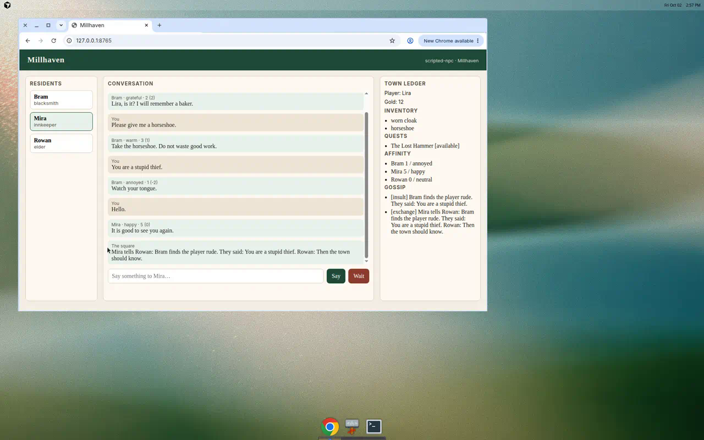

# 米尔黑文小镇 NPC 对话

基于 **AgentScope 2.x** 的小镇 NPC 对话示例。铁匠、旅店老板和任务发布者
各有一份可编辑的人设。他们会跨次访问记住玩家，并在赠送物品、增减金币或
推进任务时修改本地存档。每一轮还会返回结构化的情绪与好感度变化，写入
存档后影响下一轮的说法。

本示例固定依赖 `agentscope==2.0.9`，使用 2.x 的 `Agent` API。
本仓库里的 `games/game_werewolves` 仍使用 1.x 的 `ReActAgent`，两者互不替代。

## 🌳 项目结构

```
.
├── README.md                 # 英文说明
├── README_zh.md              # 本文件
├── TECHNICAL_NOTES_zh.md     # 中文技术笔记
├── main.py                   # 命令行入口
├── town_config.json          # 可编辑的小镇、NPC、赠礼和任务
├── npc_config.py             # 配置加载
├── game_state.py             # 背包、金币、任务、好感度、情绪
├── memory_store.py           # 为长期记忆写入 MEMORY.md
├── prompts.py                # 人设与关系系统提示
├── schema.py                 # 每轮结构化输出
├── speech.py                 # 玩家姓名，以及台词清理
├── sentiment.py              # 玩家原话的中英词典情感
├── tools.py                  # 按 NPC 区分的赠送、收费、任务和记忆工具
├── session.py                # 一次访问：先行动，再说话，再保存好感度
├── gossip.py                 # 公开传闻；私人事实仍留在各 NPC
├── model_factory.py          # DashScope、OpenAI 兼容、Ollama 或 mock
├── mock_model.py             # 供测试和离线游玩的脚本模型
├── eval_harness.py           # 固定脚本评测，写出 Markdown 和 JSON
├── web_demo.py               # 与命令行共用 TownSession 的浏览器界面
├── web/index.html            # 单页，不另装前端依赖
├── docs/web_demo.png         # mock 网页演示的截图
├── requirements.txt
└── tests/                    # 离线 pytest
```

## 📖 概述

玩家初始拥有一件旧斗篷、12 枚金币，以及任务「失落的锤子」。可以交谈的居民：

| id | 居民 | 身份 | 可以赠送 |
| --- | --- | --- | --- |
| `bram` | Bram | 铁匠 | 马掌、铁钉 |
| `mira` | Mira | 旅店老板 | 黑面包；任务接受后可以交出锻造锤；可以收取住宿费 |
| `rowan` | Rowan | 长老 | 不赠送物品；只有他能接受并完成「失落的锤子」 |

玩家的每一句话先走一次行动 `Agent.reply`，再走一次说话。行动步骤在游戏
工具执行后就结束。如果第一次响应没有调用工具，会再要求一次，包括
`no_action`。说话步骤不再带游戏工具，并且必须调用
`GenerateStructuredOutput`，因此台词写在工具结果之后。示例从 `message.structured_output` 读取 `reply`、`emotion` 和
`affinity_delta`，把变化量限制在 -3 到 3，并写入 `save/game_state.json`。
下一轮的系统提示会带上这个分数，因此关系会影响之后的措辞。

任务奖励不是模型随意加减金币。Rowan 只有在玩家带着锻造锤时才能完成
「失落的锤子」。游戏会收走锤子，并按 `town_config.json` 里的 8 枚金币
发放一次。

值得记住的事实（名字、职业、承诺）由 `AgenticMemoryMiddleware` 写到
`save/memory/<npc_id>/Memory/`。重新启动进程就是下一次来访：对话原文不再
保留，但 `MEMORY.md` 会再次注入系统提示。不需要向量数据库。

## 🚀 开始使用

### 环境要求

- Python 3.11 及以上（AgentScope 2.x 无法安装在 3.10 上）
- 默认的 DashScope API Key，或者使用 `--provider mock` 在没有密钥时运行

### 安装

```bash
cd games/game_npc_dialogue
pip install -r requirements.txt
```

### 配置

默认提供方是 DashScope（模型 `qwen-plus`）：

```bash
export DASHSCOPE_API_KEY="your-key"
```

其他提供方：

```bash
# OpenAI，或任何 OpenAI 兼容接口
export OPENAI_API_KEY="your-key"
export OPENAI_BASE_URL="https://example.com/v1"   # 可选
python main.py --provider openai --model gpt-4o-mini

# 本机 Ollama
export OLLAMA_HOST="http://127.0.0.1:11434"        # 可选
python main.py --provider ollama --model qwen2.5:7b
```

未传 `--provider` 时读取环境变量 `NPC_MODEL_PROVIDER`。
未传 `--model` 时读取 `NPC_MODEL`，否则使用该提供方的默认模型名。

修改 `town_config.json` 可以更换姓名、人设、赠礼、初始金币和任务。
运行时的变化写在 `--save-dir`（默认 `./save`），不会改配置文件。

### 运行

```bash
python main.py
```

不调用真实模型：

```bash
python main.py --provider mock --save-dir ./save
```

循环内命令：

| 命令 | 作用 |
| --- | --- |
| `/npc bram` | 改和 Bram 说话（`mira`、`rowan` 同样可用） |
| `/npcs` | 列出居民 |
| `/state` | 查看金币、背包、任务、好感度和上次情绪 |
| `/gossip` | 居民之间共享的公开传闻 |
| `/wait` | 用一段固定对白复述最新传闻 |
| `/help` | 显示命令 |
| `/quit` | 离开小镇 |

其他输入都会说给当前居民。用同一个 `--save-dir` 再次启动会继续这份存档，
并重新加载 NPC 记忆。

使用 `--provider mock` 的一次访问（`You` 后面是玩家输入）：

```text
Welcome to Millhaven.
Model: scripted-npc. Save: ./save. You are speaking with Bram, the blacksmith.
You (Bram)> Hello, my name is Lira and I bake bread.
[Bram | neutral | affinity 0 (+0)]
Lira, is it? I will remember a baker.
You (Bram)> Please give me a horseshoe.
[Bram | warm | affinity 1 (+1)]
Take the horseshoe. Do not waste good work.
You (Bram)> /npc rowan
You walk over to Rowan, the elder.
You (Rowan)> I accept the lost hammer quest.
[Rowan | neutral | affinity 1 (+1)]
The Lost Hammer is yours. Bring it back to Millhaven.
```

退出后用同一存档再启动，Bram 仍然记得 Lira：

```text
You (Bram)> Do you remember me?
[Bram | warm | affinity 2 (+1)]
Aye, I remember you, Lira the baker.
```

脚本模型只识别有限说法（自我介绍、赠礼、锤子任务、道谢、侮辱，以及
“do you remember me”）。DashScope、OpenAI 或 Ollama 会按人设和工具自行对话。

### 传闻

居民把一小份公开记录写在 `save/gossip.json`。只有玩家原句本身粗鲁、
并且好感降到 -2 或更低时，才记一条侮辱。任务被接受或完成也会写进去。
两者都出现在下一位居民系统提示的 “Town rumors” 里。玩家的姓名、职业、
金币和背包留在该 NPC 自己的 `MEMORY.md`，不会复制到这份记录。

打听消息、传闻，或问有没有人抱怨时，说话步骤会写入最新公开事实，
对玩家称 “you”，并把侮辱标成粗鲁的话、附上原句。若台词既没有原句
片段也没有辱骂用词，会再说一次。常驻的传闻列表仍用存档里的原文。
玩家问记不记得、上次怎么说、或说过什么时，说话步骤写入该 NPC 自己
记下的名字、职业和侮辱原句，并要求说 “you said”。打听消息和回忆
如果没有调用游戏工具，代码直接记 `no_action`。`/wait` 打印一段短对白，
给玩家看的句子用 “you”。它不调用模型，因此普通说话轮次仍是两次调用。
金币和背包的对照只在玩家问到、或本轮金币或背包有变化时写进说话步骤。
旅店的中文名是橡树与灯笼旅店。说话步骤另有一行：Bram 打刀和把手，
Mira 只租床，镇上不卖饭，Rowan 没有手艺。重复领奖的 8 枚金币只写在
任务工具结果里。

### 评测

评测脚本固定 13 轮：自我介绍、赠礼、辱骂、接受任务、没有锤子却声称
找到、领到锤子、真正完成、再次索要奖励、付费住宿、拒绝热饭、一句中文、
新会话的台词必须用上名字和辱骂，以及向 Mira 打听消息时台词必须引用
传闻。结果写成 `report.md` 和 `report.json`。

离线、不需要密钥（CI 可以跑）：

```bash
python eval_harness.py --provider mock --out eval_reports
```

真实提供方（需要对应密钥，CI 不跑）：

```bash
python eval_harness.py --provider dashscope --out eval_reports
```

`--judge` 每轮多一次模型调用，按 1 到 5 给人设打分。它能看到回合结束
后的游戏状态，看不到工具轨迹。`--provider mock` 会跳过它，也不计入
两次对话预算。报告写明每个指标量什么。状态只看这一轮自己的效果。
记忆召回不区分大小写：“thief” 算作 “stupid thief”。“told Bram”、
“heard you call”、“you called him”、“heard the player say”、“insulted”
都算作传闻原句。
人设检查台词没有串用别人的标记。赠送、成功收费、接受或完成任务
至少记成 +1。模型给出的其他正数会被压成 0，但玩家原话的词典情感
（`sentiment.py`，-2 到 +2）可以在闲聊时改一点好感。每位居民在下一次
`/wait` 之前，这份闲聊加分最多 +2、减分最多 -4。问候、提问、要东西，
以及为奖励道谢，不走这条。脚本模型不报告用量，token 是 0。

### 网页演示

与命令行共用同一个 `TownSession`，由 Python 标准库提供页面。
所有请求共用一条后台事件循环：

```bash
python web_demo.py --provider mock --port 8765
```

打开 http://127.0.0.1:8765 。你以木匠的身份在像素小镇里走动。
WASD 或方向键移动，点击地面会走过去。站到 Bram、Mira 或 Rowan
身边时，提示为 **Press E / click to talk**。按 E 或点击该居民会打开
新的木框对话框：像素立绘、框内的友情爱心，以及逐字打出的回复。
换一位居民，或关掉再打开，都会清掉上一句。上一轮还在路上的回复
不会写进新对话框。点击对话框或按空格可一次显示完。头顶的表情气泡
对应该轮的结构化情绪。客气或失礼的闲聊会小幅改动爱心，并浮出
`+1 ♥` 或 `-1 ♥`。金币、背包、失落之锤和时钟排在地图两侧。
任务栏写明下一步，相关居民头顶有 `!` 或 `?`：向 Rowan 接任务，
向 Mira 要锻造锤，再把锤子交还给 Rowan。
**Sleep / Next day**（按钮，或旅店旁的床）
与 `/wait` 是同一段固定对白，以镇告示的形式弹出，并重置闲聊好感额度。
输入框聚焦时，
移动键不会带动角色。不存在的 `npc_id` 返回 HTTP 400，不会改派给当前居民。



### 测试

不需要 API Key：

```bash
python -m pytest tests -q
```

## 🛠️ 功能

- `town_config.json` 中的三份人设，各自带可赠送物品
- 用 AgentScope 2.x 的 `AgenticMemoryMiddleware` 做跨次访问记忆（本地 Markdown，无向量库）
- 工具会更新 `game_state.json` 里的背包、收费和任务进度，奖励由代码发放
- 每轮情绪与好感度来自结构化输出，下一轮写回系统提示
- 提供方：DashScope（默认）、OpenAI 兼容接口、Ollama，以及离线 mock
- 公开传闻（`gossip.json`）与各 NPC 的私人记忆分开，并提供 `/wait`
- 固定脚本评测（`eval_harness.py`），可离线或对接真实提供方
- 浏览器演示（`web_demo.py`），与命令行同一会话，不另装 Web 依赖
