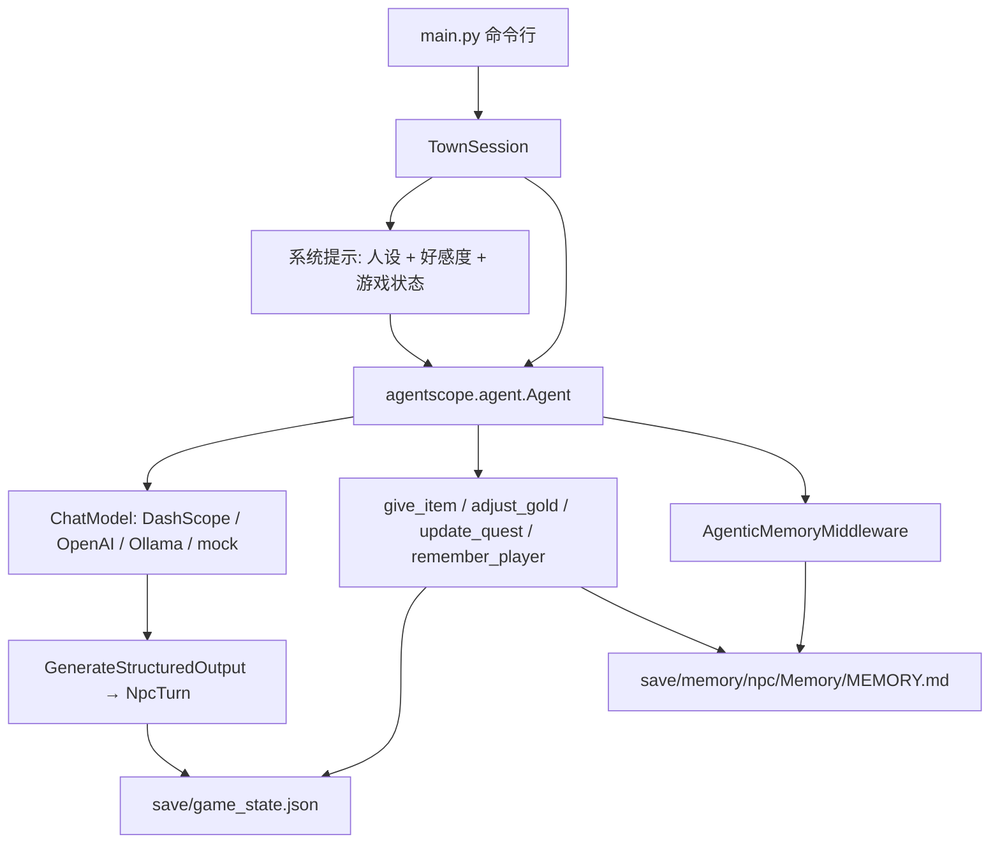

# 米尔黑文 NPC 对话：技术笔记

给审阅用的简短说明。实现见同目录代码，使用方式见 `README_zh.md`。

## 目标

在 AgentScope **2.0.9** 上做一个可放进简历的游戏向示例，覆盖贡献指南里点名的
“NPC dialogue systems”，并刻意只用 2.x API。范围控制在一座小镇、三名 NPC、
一份本地存档：

- 人设放在 `town_config.json`，不写死在提示词里。
- 跨进程记住玩家说过的身份，不引入向量数据库。
- 工具真正改写金币、背包和任务。
- 每轮给出情绪和好感度，持久化后影响下一轮提示。
- 命令行可以切换 NPC。没有 API Key 时用脚本模型把上述路径跑通。

## 架构



一次 `talk()` 会新建 `Agent`，但复用该 NPC 的 `AgentState`，所以同一次进程里的
短期对话还在。进程退出后短期上下文丢弃。下次来访只靠两份本地文件：游戏状态，
以及每个 NPC 自己的 `MEMORY.md`。

## 用到的 AgentScope 2.x API，以及为什么

| API | 用途 |
| --- | --- |
| `agentscope.agent.Agent` | 2.x 的统一智能体。1.x 的 `ReActAgent` 已不存在。 |
| `Agent.reply(..., structured_schema=NpcTurn)` | 要求本轮以结构化结果结束。字段在 `Msg.structured_output`，不在 1.x 的 `metadata`。 |
| `Toolkit` + `FunctionTool` | 把普通函数注册成工具。2.x 不再使用 `toolkit.register_tool_function`。 |
| `PermissionDecision(ALLOW)` 与 `PermissionMode.BYPASS` | 自定义工具默认会向用户确认。游戏循环不能停下来等确认，因此显式放行。 |
| `AgenticMemoryMiddleware` | 2.x 的文件型长期记忆。本地 Markdown，不需要 mem0 / Qdrant。 |
| `UserMsg` | 2.x 的用户消息构造函数。 |
| `DashScopeChatModel` + `DashScopeCredential` | 默认模型。密钥来自 `DASHSCOPE_API_KEY`，不再把 `api_key=` 直接传给模型。 |
| `OpenAIChatModel` / `OllamaChatModel` | 可选提供方。OpenAI 凭证上的 `base_url` 即兼容接口。 |
| `InjectionConfig(inject_runtime_state=False)` | 关掉默认的时间与任务注入，避免游戏提示被编码助手风格的运行时状态淹没。 |

`AgenticMemoryMiddleware` 的 `retrieval_async=False`。打开后，中间件会再用
一次对话模型挑选记忆文件；离线测试和没有额外调用预算的 CLI 都不适合。
因此索引行本身写上事实全文，下一轮系统提示就能直接看到，不必再 `Read` 文件。

没有使用 `Mem0Middleware`：开源 mem0 默认走向量库。也没有使用 `ReMeMiddleware`：
它会再调一次模型做抽取，没有密钥就无法在测试里落盘。

## 记忆、工具、情绪如何配合

**记忆。** `remember_player(fact)` 在该 NPC 的 `Memory/` 下追加 `fact_N.md`
（带 frontmatter，符合中间件扫描格式），并在 `MEMORY.md` 增加一行
`- [Fact N](fact_N.md) — <事实>`。中间件的 `on_system_prompt` 会把 `MEMORY.md`
拼进系统提示。测试用两个 `TownSession`、同一 `save_dir`、两份新的 `AgentState`
证明：第二次调用时模型收到的系统提示含有 “Lira”，回复也点出这个名字。

**工具。** `give_item` 只能送出该 NPC 配置里的赠礼；`adjust_gold` 拒绝让金币
变成负数；`update_quest` 只接受 `available` / `accepted` / `completed`。
三个写操作都 `is_concurrency_safe=False`，因此先于结构化输出顺序执行，并立即
`save()`。脚本模型在一句话里同时发出游戏工具和 `GenerateStructuredOutput`，
测试再从磁盘重新加载 `GameState` 检查马掌、任务和金币。

**情绪与好感。** `NpcTurn` 含 `reply`、`emotion`、`affinity_delta`（-3 到 3）
和 `affinity_reason`。应用层把分数夹在 -100 到 100，并把情绪记在同一份 JSON。
下一轮 `build_system_prompt` 写入 `Affinity: N` 和上次情绪。脚本模型见到
`Affinity: 2` 以上的问候时，会改说 “It is good to see you again.”，用来证明
持久化后的分数真的进入了后续提示，而不是只打印出来。

## 测试策略与结果

全部离线，模型是 `ScriptedNpcModel`（实现 `ChatModelBase._call_api`，不访问网络）。

```bash
cd games/game_npc_dialogue
python -m pytest tests -q
```

在 Python 3.12.3、`agentscope==2.0.9` 上结果为 **11 passed**。覆盖：

- 人设加载，以及三份系统提示互不串人设（`test_persona.py`）
- 记忆文件跨 session 注入（`test_memory.py`）
- 工具调用改写背包、任务、金币，以及拒绝不属于该 NPC 的赠礼（`test_tools.py`）
- 情绪与好感度解析、落盘，并改变下一次问候（`test_emotion.py`）
- 两个进程的 CLI：介绍自己、拿马掌、接任务，再次启动后记得 Lira（`test_cli.py`）

另外用同一脚本模型手工跑过 CLI，记录见 `README_zh.md` 的示例访问。
真实 DashScope / OpenAI / Ollama 调用没有跑，当前环境没有 API Key，也没有
本地 Ollama。

静态检查按仓库 `.pre-commit-config.yaml` 的参数，在本示例的 Python 文件上
通过了 Black 23.3.0（行宽 79）、Flake8、Mypy 1.7.0 和 Pylint 3.0.2。
仓库 CI 的 pre-commit 跑在 Python 3.10 上，只做语法和风格，不导入 agentscope，
因此示例源码保持 3.10 语法；真正运行仍要 3.11+。

## 2.x 上实际踩到的差异

- 最终那条 `reply()` 消息的正文是固定的 “The required structured output is generated.” 台词在 `structured_output["reply"]`。
- 自定义 `ChatModelBase` 必须自己设置 `formatter`。`Agent` 在调用模型前会读 `model.formatter.supported_input_media_types`，内置模型在构造函数里赋值，子类不会自动有。
- `FunctionTool` 不传 `permission` 时行为是 ASK，无人值守循环会停在确认上。
- 结构化输出不是模型直接吐 JSON，而是调用内置工具 `GenerateStructuredOutput`。参数名必须和 Pydantic 字段一致。
- `AgenticMemoryMiddleware` 默认的记忆说明是面向编程助手的长提示，并且默认会再发一次检索模型调用。游戏示例换成了短说明，并关闭了异步检索。

## 局限

- 脚本模型是关键词分支，不能代表真实模型是否稳定调用工具或遵守人设。
- 关闭异步检索后，只有 `MEMORY.md` 的索引行进入上下文。事实写在索引行里，文件正文不会自动展开。
- 同一进程内的聊天没有单独序列化。只保证游戏状态和长期记忆跨进程。
- 三名 NPC 不共享记忆，也不会互相交谈。
- 好感度是一个整数，没有事件时间线。
- 工具在 `BYPASS` 模式下执行，适合这个本地单人循环，不适合不可信环境。

## 可能的下一步

- 接 `agentscope.middleware.TTSMiddleware` 或 DashScope CosyVoice，把 `reply` 读出来。2.0.9 已有 TTS 模型类，本示例没有声音输出。
- 打开 `retrieval_async`，用真实模型从多份 `fact_N.md` 里挑选相关记忆。
- 让旅店老板的记忆对铁匠可见，做成镇上流言。
- 为真实模型补一小段人工对话记录，核对它是否在该调用工具时调用、并让好感度变化合理。
