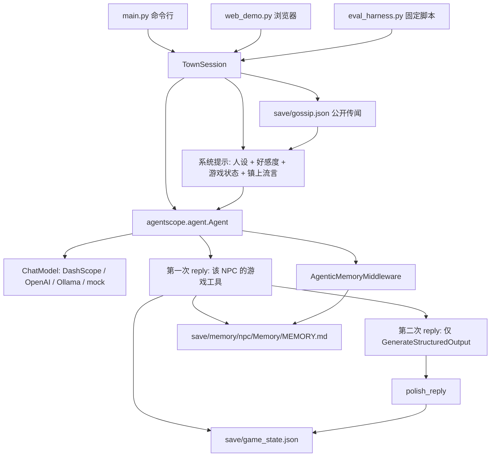

# 米尔黑文 NPC 对话：技术笔记

给审阅用的简短说明。实现见同目录代码，使用方式见 `README_zh.md`。

## 目标

在 AgentScope **2.0.9** 上做一个可放进简历的游戏向示例，覆盖贡献指南里点名的
“NPC dialogue systems”，并刻意只用 2.x API。范围控制在一座小镇、三名 NPC、
一份本地存档：

- 人设放在 `town_config.json`，不写死在提示词里。
- 跨进程记住玩家说过的身份，不引入向量数据库。
- 工具真正改写金币、背包和任务。
- 每轮给出情绪和好感度，持久化后影响下一轮提示。
- 命令行可以切换 NPC。没有 API Key 时用脚本模型把上述路径跑通。
- 公开传闻与私人记忆分开，并有一段不调用模型的居民对白。
- 固定脚本评测可以离线跑完，也可以换真实提供方。
- 浏览器页面与命令行共用同一个 `TownSession`。

## 架构



一次 `talk()` 会建两个 `Agent`：第一个带着该 NPC 的游戏工具，不要求结构化
输出；第二个不带游戏工具，只生成 `NpcTurn`。两者复用该 NPC 的 `AgentState`，
所以同一次进程里的短期对话还在，第二段也能看到第一段的工具结果。进程退出后
短期上下文丢弃。下次来访只靠两份本地文件：游戏状态，以及每个 NPC 自己的
`MEMORY.md`。

## 用到的 AgentScope 2.x API，以及为什么

| API | 用途 |
| --- | --- |
| `agentscope.agent.Agent` | 2.x 的统一智能体。1.x 的 `ReActAgent` 已不存在。 |
| `Agent.reply(..., structured_schema=NpcTurn)` | 要求本轮以结构化结果结束。字段在 `Msg.structured_output`，不在 1.x 的 `metadata`。 |
| `Toolkit` + `FunctionTool` | 把普通函数注册成工具。2.x 不再使用 `toolkit.register_tool_function`。 |
| `PermissionDecision(ALLOW)` 与 `PermissionMode.BYPASS` | 自定义工具默认会向用户确认。游戏循环不能停下来等确认，因此显式放行。 |
| `AgenticMemoryMiddleware` | 2.x 的文件型长期记忆。本地 Markdown，不需要 mem0 / Qdrant。 |
| `UserMsg` | 2.x 的用户消息构造函数。 |
| `DashScopeChatModel` + `DashScopeCredential` | 默认模型。密钥来自 `DASHSCOPE_API_KEY`，不再把 `api_key=` 直接传给模型。 |
| `OpenAIChatModel` / `OllamaChatModel` | 可选提供方。OpenAI 凭证上的 `base_url` 即兼容接口。 |
| `InjectionConfig(inject_runtime_state=False)` | 关掉默认的时间与任务注入，避免游戏提示被编码助手风格的运行时状态淹没。 |

`AgenticMemoryMiddleware` 的 `retrieval_async=False`。打开后，中间件会再用
一次对话模型挑选记忆文件；离线测试和没有额外调用预算的 CLI 都不适合。
因此索引行本身写上事实全文，下一轮系统提示就能直接看到，不必再 `Read` 文件。

没有使用 `Mem0Middleware`：开源 mem0 默认走向量库。也没有使用 `ReMeMiddleware`：
它会再调一次模型做抽取，没有密钥就无法在测试里落盘。

## 记忆、工具、情绪如何配合

**记忆。** `remember_player(fact)` 在该 NPC 的 `Memory/` 下追加 `fact_N.md`
（带 frontmatter，符合中间件扫描格式），并在 `MEMORY.md` 增加一行
`- [Fact N](fact_N.md) — <事实>`。中间件的 `on_system_prompt` 会把 `MEMORY.md`
拼进系统提示。测试用两个 `TownSession`、同一 `save_dir`、两份新的 `AgentState`
证明：第二次调用时模型收到的系统提示含有 “Lira”，回复也点出这个名字。

**工具。** 每个 NPC 只有自己用得上的工具。三人都有 `give_item` 和
`remember_player`。只有 `can_charge` 的 Mira 有 `charge_player`，而且它只扣
金币。只有任务发布者 Rowan 有 `accept_quest` 和 `complete_quest`。模型没有
`update_quest`，也不能直接加金币。完成「失落的锤子」必须由 Rowan 发起、任务
已是 `accepted`、背包里有 `forging hammer`。代码收走锤子，把状态写成
`completed`，并按配置里的 `reward_gold`（8）支付一次，同时置 `rewarded`。
已经完成或已经发过奖的调用是空操作。旧存档如果只有 `completed`、没有
`rewarded`，也视为已经发过。锤子本身由 Mira 的 `quest_gifts` 在任务被接受后
送出，口头宣称不会凭空生成物品。写操作都 `is_concurrency_safe=False`，并立即
`save()`。

**情绪与好感。** `NpcTurn` 含 `reply`、`emotion`、`affinity_delta`（-3 到 3）
和 `affinity_reason`。应用层把分数夹在 -100 到 100，并把情绪记在同一份 JSON。
下一轮 `build_system_prompt` 写入 `Affinity: N` 和上次情绪。脚本模型见到
`Affinity: 2` 以上的问候时，会改说 “It is good to see you again.”，用来证明
持久化后的分数真的进入了后续提示，而不是只打印出来。

## 测试策略与结果

全部离线，模型是 `ScriptedNpcModel`（实现 `ChatModelBase._call_api`，不访问网络）。

```bash
cd games/game_npc_dialogue
python -m pytest tests -q
```

在 Python 3.12.3、`agentscope==2.0.9` 上结果为 **32 passed**。覆盖：

- 人设加载，以及三份系统提示互不串人设（`test_persona.py`）
- 记忆文件跨 session 注入（`test_memory.py`）
- 工具调用改写背包、任务、金币，以及拒绝不属于该 NPC 的赠礼（`test_tools.py`）
- 情绪与好感度解析、落盘，并改变下一次问候（`test_emotion.py`）
- 两个进程的 CLI：介绍自己、拿马掌、接任务，再次启动后记得 Lira（`test_cli.py`）
- 实机里暴露的规则：空口交任务被拒绝、奖励只发一次、工具按 NPC 限制、
  语言按玩家原句写进说话提示、自报姓名会更新并写入记忆、问句不会改名、
  强烈好感变化写入记忆、台词发生在工具结果之后、只有文字的行动阶段不能
  送出物品或收钱、中文分句和引号分句、收费成功后的 “here you go” /
  “给你” 不再被当成假赠送、任务工具返回 already/cannot 时好感不能上升
  （`test_live_fixes.py`）
- 侮辱和任务进展进入公开传闻，姓名和职业不进入；`/wait` 复述最新传闻
  （`test_gossip.py`）
- 固定脚本评测在 mock 上状态、记忆、语言、人设、好感均为 1.0，且每轮
  2 次调用（`test_eval.py`）
- 网页返回页面和账本，说话与等待走同一 `TownSession`（`test_web.py`）

另外用同一脚本模型手工跑过 CLI，记录见 `README_zh.md` 的示例访问。
DashScope `qwen-plus` 的一次实机记录见下一节。OpenAI 与 Ollama 没有跑。

静态检查按仓库 `.pre-commit-config.yaml` 的参数，在本示例的 Python 文件上
通过了 Black 23.3.0（行宽 79）、Flake8、Mypy 1.7.0 和 Pylint 3.0.2。
仓库 CI 的 pre-commit 跑在 Python 3.10 上，只做语法和风格，不导入 agentscope，
因此示例源码保持 3.10 语法；真正运行仍要 3.11+。

## 2.x 上实际踩到的差异

- 最终那条 `reply()` 消息的正文是固定的 “The required structured output is generated.” 台词在 `structured_output["reply"]`。
- 自定义 `ChatModelBase` 必须自己设置 `formatter`。`Agent` 在调用模型前会读 `model.formatter.supported_input_media_types`，内置模型在构造函数里赋值，子类不会自动有。
- `FunctionTool` 不传 `permission` 时行为是 ASK，无人值守循环会停在确认上。
- 结构化输出不是模型直接吐 JSON，而是调用内置工具 `GenerateStructuredOutput`。参数名必须和 Pydantic 字段一致。
- `AgenticMemoryMiddleware` 默认的记忆说明是面向编程助手的长提示，并且默认会再发一次检索模型调用。游戏示例换成了短说明，并关闭了异步检索。

## 实机测试发现与修复

用 DashScope `qwen-plus` 跑了 3 次来访、16 轮对话，没有异常。结构化输出每轮
都有，三个人设能分开，跨 session 的名字记忆也生效。合计 25 次模型调用，输入
37457 token、输出 2219 token。16 轮延迟合计 72.3 秒，平均约 4.5 秒/轮（约
4.6 秒）。

这次记录暴露的问题，以及代码里的对应改动：

1. 背包里没有锻造锤时，Bram 仍调用 `update_quest(completed)`。任何 NPC 都能改
   任何任务和金币。现在规则在配置和 `GameState` 里：只有发布者能接受和完成，
   只能完成一次，必须先带着要求的物品。奖励由代码支付。
2. 同一会话里，Rowan 对一句无关的话又调用了 `adjust_gold(+5)` 和
   `update_quest`，金币从 9 加到 14，下一轮中文提问又加到 19。已完成的任务
   再更新是空操作，不会第二次付钱。
3. 游戏工具和 `GenerateStructuredOutput` 出现在同一次响应里，台词在工具结果
   返回之前就写好了。`talk()` 先行动、再单独生成结构化台词，展示前再走
   `polish_reply`。
4. 玩家说中文时，除非明确要求，回复仍是英文。提示要求使用玩家刚才的语言。
5. 礼貌但做不到的请求（钢剑）被扣了 2 点好感。提示写明：只有粗鲁、威胁或
   失信才扣分，做不到的礼貌请求是 0。
6. 辱骂和接任务没有写入记忆，所以第二次 Bram 说自己不记得语气，尽管好感已经
   是 -4。`|delta| >= 2` 时自动写一条记忆，并把上一次强烈印象放进提示。接受
   和完成任务也会记一笔。
7. `player.name` 一直是 Traveler，Rowan 继续这么称呼。英文 “my name is …” 和
   中文 “我叫…” 会在生成本轮提示之前更新名字。
8. Mira 超过一两句，还写了 `*wipes a mug*`，并且口头答应给面包但没有调用工具。
   提示限制句数和舞台指示；`polish_reply` 去掉星号动作并只留两句。
9. 纯文本里曾漏出 `neutral`、`0` 和 `affinity_reason`。命令行本来就读
   `structured_output`；`polish_reply` 再丢掉单独成行的情绪词、整数，以及与
   理由完全相同的那一行。

离线测试盖住了空口交任务、重复发奖、按 NPC 限制工具、提示里的语言规则，以及
台词发生在工具结果之后。第二轮实机见下一小节。

### 第二轮（qwen-plus，commit 64c6089）

3 次来访、23 轮对话，没有异常。合计 58 次模型调用，输入 81607 token、输出
2442 token，约 2.5 次调用/轮。延迟合计 100.1 秒，平均约 4.4 秒/轮。每轮输入
约 3.5k token，比第一轮的约 2.3k 高大约 52%。多出来的主要是写进
`AgentState` 的 `SPEAK_NOW` 指令，以及行动阶段没被丢掉的台词。

这一轮已经按预期工作的部分：没有锤子时任务完不成；米拉交出锤子之后，完成
任务只发配置里的 8 枚金币（吃饭扣掉 2 枚之后是 10，发奖后是 18），再要一次
也不会再发。索要钢剑的好感变化是 0。显示出来的台词没有舞台指示。辱骂在下一
次来访被 Bram 复述。Rowan 在 “My name is Kestrel” 之后使用了这个名字。

这一轮新暴露的问题，以及这次的改动：

1. 行动阶段经常只写台词、不调用工具，说话阶段又把那句台词抄出来。Mira 说
   “Here you go!” 但没有 `give_item`，锤子没进背包；说 “That'll be three
   gold” 但没有 `charge_player`，金币仍是 12。Bram 说给了铁钉，同样没有工具
   调用。现在行动阶段必须调用工具（`tool_choice=required`），无事可做时调用
   `no_action`。说话之前会从上下文里删掉行动阶段的纯文本，只留下工具调用和
   结果。若台词仍声称送了东西或收了钱，而本轮并没有成功的 `give_item` 或
   `charge_player`，代码会换成一句如实的说明，不再另调一次模型。
2. 中文有时得到英文，切回英文后 Mira 仍用中文。原因是说话阶段最后一条用户
   消息是英文的 `SPEAK_NOW`。现在根据玩家原句里有没有汉字，在说话提示里写明
   “Reply in Simplified Chinese” 或 “Reply in English”，并把玩家原句放进该
   提示。这条指令在本轮用完后从 `AgentState` 删除，不进入之后的历史。
3. “你还记得我叫什么吗？” 把名字改成了 “什么吗”。“My name is not important”
   会得到 “Not”。问句和否定说法不再当成自我介绍，英文可以是 “Mary Ann” 这样
   的多词名字。
4. 分句正则要求标点后面有空白，所以中文三句不会被截成两句，`.”` 也不会断开。
   现在标点后可以没有空白，也可以紧跟引号。
5. 见上面的 token 数字。`SPEAK_NOW` 和行动阶段的台词不再留在历史里。
6. 中文自报姓名只改了 `player.name`，Mira 的 `MEMORY.md` 是空的。认出名字时
   代码会写一条 “The player's name is …”。

第三轮实机见下一小节。

### 第三轮（qwen-plus，commit fb3206b）

与第二轮相同的 23 轮脚本：86 次模型调用（3.7 次/轮），输入 119667 token
（约 5.2k/轮），输出 4886 token，延迟合计 182.2 秒，平均 7.9 秒/轮。另有
4 轮附加探针。整份记录是 27 轮、98 次调用、输入 132895、输出 5963、延迟
合计 278.1 秒，其中附加轮有一次 71.4 秒。对照第二轮的 58 次调用、约
3.5k 输入/轮、输出 2442、平均 4.4 秒/轮，成本和延迟都退步了。

正确性是好的：礼物和收费都走了 `give_item` / `charge_player`，该用
`no_action` 的时候用了，代码守卫 0 次替换，任务流程和单次 8 金币正确，
名字解析和 `MEMORY.md` 正确，跨会话辱骂和姓名还在，13 次语言切换里
12 次正确。

退步来自多余的模型往返，这次的改动针对这些：

1. 行动阶段 6 次调用了并不在工具列表里的 `GenerateStructuredOutput`。
   原因是历史里留着上一轮的这个调用和说出来的台词，模型跟着模仿，并且
   英文台词留在上下文里，造成了那一次中文问句得到英文回答。现在
   `AgentState` 只保留玩家原句和真正的游戏工具调用与结果。结构化输出
   调用、`SPEAK_NOW`、`ACT_NOW` 和说出来的台词都在本轮结束时删掉。
2. 情绪不在枚举里（`irritated`、`calm`）或 `affinity_delta=-15` 时，
   schema 的 `Literal` / `ge` / `le` 会在代码夹取之前拒绝，同一轮重试到
   5–6 次、约 1.1 万输入 token。schema 不再限制取值范围。代码把未知情绪
   映射到最近的允许值，并把 delta 夹到 -3..3。说话提示列出六个允许情绪
   和这个范围。
3. DashScope 不支持 `tool_choice=required`，会转成 `auto` 并打印警告，
   所以它并没有强制调用工具。行动步骤不再发送 `required`。如果第一次
   行动响应没有游戏工具结果，只再请求一次，并写明必须调用工具。
4. 工具结果返回后，行动循环还会再生成一段随后被删掉的散文。游戏工具
   一旦执行完，中间件直接结束行动循环，不再为这段散文调用模型。
5. 按句数截断会丢掉短句后面的关键信息（Mira 只剩 “Ah—yes! Bram's
   hammer.”）。现在先把很短的句子并进下一句，再按 240 个字符截断，并
   至少保留第一句。中文句子之间不再多插一个空格。
6. Rowan 的可赠送列表里去掉了镇印，`give_item` 会拒绝它。提示里写明
   锤子在任务完成前一直是丢失的，不要说它从未丢失，也不要把玩家的
   职业安到别的居民身上。

正常一轮预期是 2 次模型调用：1 次行动（响应里已经带了游戏工具）加 1 次
说话。只有第一次行动没有调用工具时才多 1 次补救。不再为工具之后的散文
或 schema 校验失败追加调用。历史不再累积结构化输出和台词，输入 token
应回到第二轮的约 3.5k/轮或更低。

第四轮实机见下一小节。

### 第四轮（qwen-plus，commit fc9817f）

与前几轮可比的是前 3 次来访、23 轮。性能修复生效：行动阶段没有
`GenerateStructuredOutput`，没有结构化输出重试，也没有 DashScope 把
`required` 转成 `auto` 的警告。27 轮语言全部正确（含附加的 4 轮）。
任务和单次 8 金币正确，跨会话记忆正确，截断没有丢掉关键句。27 轮里有
7 轮触发了一次 `ACT_NOW` 补救，多半是闲聊或问记忆。

五轮对照表在下一小节。第 4 轮另有 4 轮附加探针（8 次调用，输入 9239，
输出 599）。整份记录是 27 轮、61 次调用。

这一轮新暴露的问题，以及这次的改动：

1. Mira 成功扣了 3 枚金币，台词是 “Here you go, Kestrel — a warm bed…”。
   守卫把 “here you go” 当成赠送，换成了 “coins are unchanged”，和实际
   扣款相反。中文 “给你” 同样会误伤。收费已经成功时，这两句不再当成
   赠送。若仍然要替换，替换句会写明本轮扣过金币，不会再说金币没变。
2. 再次上交锤子时工具返回 already completed，Rowan 仍给了 +2 并写入记忆。
   Bram 只被问锤子找回来没有，就给了 +3。任务工具结果是 already 或
   cannot（没有真正接受或完成）时，代码把正的 affinity delta 压到 0。
   说话提示写明：只有本轮工具结果里发生的事才能加好感。
3. 行动提示写明闲聊和询问记忆必须调用 `no_action`，并给了一句
   “What is my name?” 的例子，用来减少补救调用。
4. 说话提示要求直接调用 `GenerateStructuredOutput`，不要先把情绪和
   好感写成纯文本。

第五轮实机见下一小节。

### 第五轮（qwen-plus，commit f0cd17c）

前 3 次来访、23 轮是目前最好的一轮：47 次调用（2.04 次/轮），输入
57414 token（约 2.5k/轮），输出 3046 token，延迟合计 108.0 秒，平均
4.7 秒，最大 6.1 秒。27 轮里只补救了 1 次，守卫 0 次，没有错误或
警告。重复上交锤子的好感是 0。另有 4 轮附加探针（9 次调用，输入
9913，输出 566）。整份记录是 27 轮、56 次调用。

四轮之后又加了第五轮（第 2–5 轮是同一份 23 轮脚本）：

| 轮次 | 轮数 | 调用 | 输入 token | 输出 token | 每轮输入 | 延迟 |
| --- | --- | --- | --- | --- | --- | --- |
| 1 | 16 | 25（1.6/轮） | 37457 | 2219 | 约 2.3k | 合计 72.3 秒，均 4.5 秒 |
| 2 | 23 | 58（2.5/轮） | 81607 | 2442 | 约 3.5k | 合计 100.1 秒，均 4.4 秒 |
| 3 | 23 | 86（3.7/轮） | 119667 | 4886 | 约 5.2k | 合计 182.2 秒，均 7.9 秒 |
| 4 | 23 | 53（2.3/轮） | 64007 | 3621 | 约 2.8k | 合计 123.7 秒，均 5.4 秒，最大 10.5 秒 |
| 5 | 23 | 47（2.0/轮） | 57414 | 3046 | 约 2.5k | 合计 108.0 秒，均 4.7 秒，最大 6.1 秒 |

这一轮新暴露的问题，以及这次的改动：

1. 提示里写死了 “Bram lost his forging hammer. It stays lost until that
   quest status is completed.” 任务完成后 Bram 仍说锤子没找回来，并把一句
   礼貌的中文提问记成 rudeness、扣了 1 点。Mira 也说锤子自从丢失后再没见过。
   这句事实改为按任务状态生成：完成后是 “The hammer was returned; the
   quest is completed.” 提示写明礼貌提问绝不是粗鲁。代码里礼貌提问也不会
   再扣好感。
2. Mira 为 “hot meal” 扣了 2 枚金币，接着又说自己不供应热饭。收费只允许
   配置里的服务（床、房间）。说话提示会写明本轮扣款的项目，并要求确认。
   若台词仍然拒绝这项服务，代码退回金币并换一句说明。
3. “米拉，能给我一条黑面包吗？” 得到了英文。玩家原句要求中文、而回复里
   没有汉字时，说话步骤会再生成一次。

## 评测方法与离线结果

`eval_harness.py` 用同一份 `TownSession.talk()`，不另写一套对话逻辑。
脚本固定 13 轮，顺序是：向 Bram 自报姓名与职业、要马掌、辱骂、向 Rowan
接受任务、没有锤子时声称已找到、向 Mira 领取锻造锤、交还锤子并领 8 枚
金币、再次索要奖励、向 Mira 支付床位、要求热饭（应拒绝）、一句中文、
新进程里问 Bram 是否记得自己、再向 Mira 问好以确认传闻已进入系统提示。

指标都按这一份脚本计算：

| 指标 | 怎么判 |
| --- | --- |
| 状态正确率 | 该轮结束后的金币、姓名、任务状态、背包与脚本期望一致，因此口头说法和工具结果必须落到同一份 `game_state` |
| 记忆召回率 | 只统计标了 `recall_system_has` 的轮次。新会话的系统提示必须同时含有 “Kestrel” 和 “stupid thief”；Mira 的系统提示必须含有 “finds the player rude” |
| 语言一致率 | `reply_language(reply)` 与玩家原句的语言相同 |
| 人设一致率 | 台词不得包含另一名 NPC 的专有标记（Bram 的锤击、Mira 的 Oak and Lantern、Rowan 的 town council）。`--judge` 另用模型按 1–5 打分，3 分及以上算过；mock 跳过，且这次调用不计入对话预算 |
| 好感合理性 | 该轮 `affinity_delta` 的符号符合脚本（正、负、零或非负） |
| 调用 / token / 延迟 | 包装 `ChatModel._call_api`，按轮汇总次数、输入输出 token 和墙钟时间 |

离线命令：

```bash
cd games/game_npc_dialogue
python eval_harness.py --provider mock --out eval_reports
```

在 Python 3.12.3、`agentscope==2.0.9`、模型 `scripted-npc` 上，13 轮结果
（`Judge: skipped`）：

| 指标 | 值 |
| --- | --- |
| 状态正确率 | 100% |
| 记忆召回率 | 100% |
| 语言一致率 | 100% |
| 人设一致率 | 100% |
| 好感合理性 | 100% |
| 每轮调用 | 2.00 |
| 输入 / 输出 token | 0 / 0（脚本模型不报告用量） |
| 平均 / 最大延迟 | 0.020 秒 / 0.062 秒 |

`pytest` 里的 `test_eval.py` 断言同一组比率为 1.0 且每轮 2 次调用，因此
CI 不需要单独跑上面的命令。`eval_reports/` 已加入 `.gitignore`。
DashScope 实机评测和 `--judge` 没有跑。

## 传闻

`gossip.py` 在 `talk()` 应用好感之后写 `save/gossip.json`，不增加模型
调用。公开的只有两类：`affinity_delta <= -2` 的侮辱，以及任务被接受或
完成。姓名、职业、金币、背包留在各自的 `MEMORY.md`。系统提示始终有
“Town rumors” 一节；没有传闻时写明哪些会公开、哪些保持私人。`/wait`
和网页上的 Wait 调用 `narrate_wait`：由 Mira 或 Rowan 用固定句子复述
最新一条公开传闻，并记一条 `exchange`。这段对白不进入模型。

## 局限

- 脚本模型是关键词分支，不能代表真实模型是否稳定调用工具或遵守人设。
- 关闭异步检索后，只有 `MEMORY.md` 的索引行进入上下文。事实写在索引行里，文件正文不会自动展开。
- 同一进程内的聊天没有单独序列化。只保证游戏状态和长期记忆跨进程。
- 公开传闻只有侮辱和任务进展。居民对白是固定句子，不是模型生成的对话。
- 好感度是一个整数，没有事件时间线。
- 工具在 `BYPASS` 模式下执行，适合这个本地单人循环，不适合不可信环境。

## 可能的下一步

- 接 `agentscope.middleware.TTSMiddleware` 或 DashScope CosyVoice，把 `reply` 读出来。2.0.9 已有 TTS 模型类，本示例没有声音输出。
- 打开 `retrieval_async`，用真实模型从多份 `fact_N.md` 里挑选相关记忆。
- 用 `python eval_harness.py --provider dashscope --judge` 给同一份 13 轮
  脚本留下实机分数。网页也可以换成 `--provider dashscope`。
- 为真实模型补一小段人工对话记录，核对它是否在该调用工具时调用、并让好感度变化合理。
